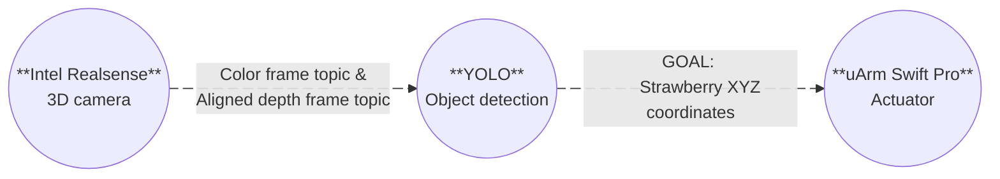
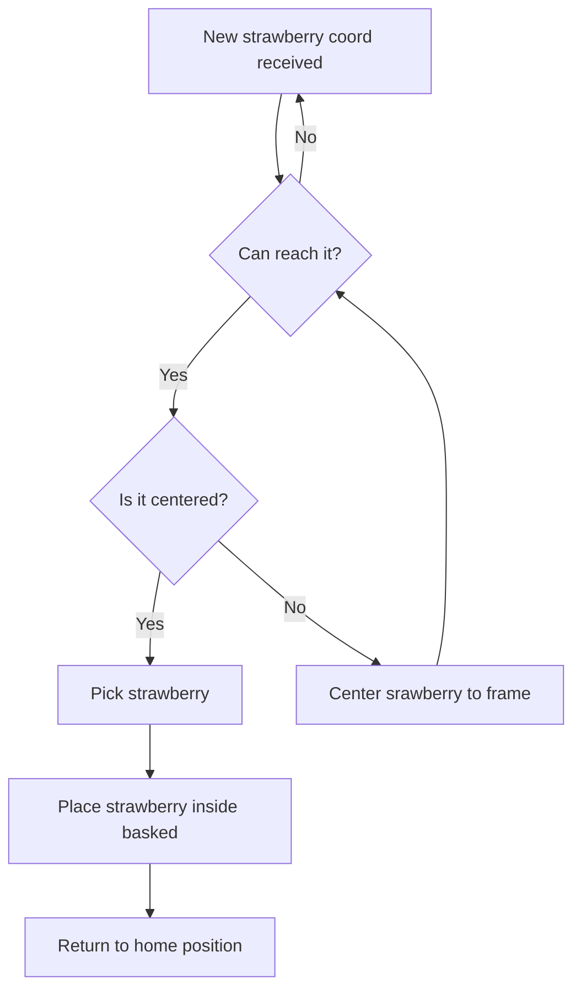

# iPick  - Autonomous Strawberry Picking Robot

## Preface
This robot was created as a final Capstone project to demonstrate the knowledge we have gained about mechatronics systems from the robotics and mechatronics program at BCIT.
The objective was to create an autonomous robot capable of detecting and picking strawberries.

## Introduction
The iPick, introduces automation to agricultural processes by incorporating advanced robotics, AI, and computer vision technology to create an autonomous solution specifically tailored for strawberry harvesting. 

Goals:

- Learn ROS2 
- Autonomous detection and picking of ripe strawberries
- Accurate object detection in real time
- Robust and efficient robotic operation

A video of the robot in function is visible [**here**](https://youtu.be/B5_kExxrY40).

## System Overview
As an initial platform for our robot, we were given a 4-wheel rover with 4 motors and no controller and a uArm Swift Pro (which I wouldn't reccoment to the worst of my enemies more on it later).

|Requirement Description         | Component / Methodology       | Chosen / Available    |
|-------------------------------:|-------------------------------|-----------------------|
|  Highly precise fruit detection|YOLO11 Object detection        |Chosen                 |
|3D Vision                       |Intel RealSense D435i Camera   |Chosen                 |
|Robotic Arm                     |UArm Swift Pro                 |Available              |
|Strong computational power      |NVIDIA Jetson Orin Nano        |Chosen                 |
|System integration            |ROS2                           |Chosen                 |
|Clean cable management          |Custom-designed PCB            |Custom design          |
|Stable mobile platform          |Four-wheel drive rover         |Available              |


## Hardware

Following is a diagram of the robot's Hardware 


The main computational power of the robot comes from the Jetson, while an arduino controls and reads the rover encoders. <br>
For the purpose of this library, I am only focusing in the arm unit with the camera attached ignoring the rover with exception of the Jetson.

A gripper extension was built to increase the reach of the arm


Also a PCB was designed to improve all the cable management from the Arduino to the motor drivers and encoders


## Software
The perception pipeline works as follow:


The **swftpro_py** package was written from scratch, and includes  the ``swiftpro_read_node`` that routinely publish the current ``tf`` of the arm with respect to the base. This node also hosts the action server node for the picking operation (initially a server_node was created, but the arm was glitching as it couldn't read the current position while it was moving, to fix the problem and simplify the process, a boolean ``self.is_moving`` was created inside ``swiftpro_read_node.py`` to prevent glitches). 


**Intel Realsense node** is responsible of reading and publishing the frames from the camera as ROS messages. <BR> 
It uses the ROS library from Intel, which simplifies the process. It publishes in different topics the color image, the aligned depth info, as well as the intrinsic and extrinsic informations of the camera. <BR>
The **rs_launch.py** is used to setup the camera parameters and filters. I added a few lines to declare the position of the camera with respect to the arm as follow:

```python
def generate_static_tf_launch_description():
    return LaunchDescription([
        Node(
            package='tf2_ros',
            executable='static_transform_publisher',
            arguments=[
                '--x', '0.0', '--y', '0.0325', '--z', '0.045',  
                '--yaw', '0', '--pitch', '0', '--roll',
                '0', '--frame-id', 'gripper_link', '--child-frame-id', 'camera_link']
        ),
    ])
```

The images are then processed using **YOLO** (You Only Look Once). A model capable of detecting ripe strawberries has been trained with both proprietary images as well as Roboflow datasets.

The **YOLO** node processes the ncoming RGB and depth data streams to detect and locate strawberries. Extensive camera calibration procedures and rigorous tests were conducted to optimize and validate the accuracy of fruit localization under various operational conditions. The process performs the following steps: 

1)    Camera data is received by the YOLO node 

1)    YOLO processes the RGB images generating 2D bounding boxes around them 

3)    Corresponding depth data within each bounding box is extracted and filtered from the aligned depth image 

4)    Using the filtered depth data, a 3D bounding box is constructed around each detected strawberry. 

5)    XYZ coordinates of each strawberry’s bounding box center are published as target positions. 

Following is an example of a detected strawberry visualized in RViz:


If one or more strawberries are detected the coordinates are published in the ``/yolo/strawberry_arm_coord`` topic.

The **SwiftPro**subscribes to this topic. If it is not already trying to pick a strawberry, the client will send a goal to the arm server in order to start the picking process.


The server will perform the following logic:


 
 ## Conclusions 
 Overall the system has functioned as intended. Unfortunately I don't have access to the ARM anymore, therefore, I won't be able to continue the development.
 It gave me the chance to start exploring with ROS2 and learn many new topics.

 The next steps  would have been: 
- Create a launch file to simplify the spawning
- Rewrite the detection system using to leverage NVIDIA NITROS, this would allow  for better performance thanks to the zero-copy image processing.
- Add navigation capabilities for the rover, to reach all strawberries.
